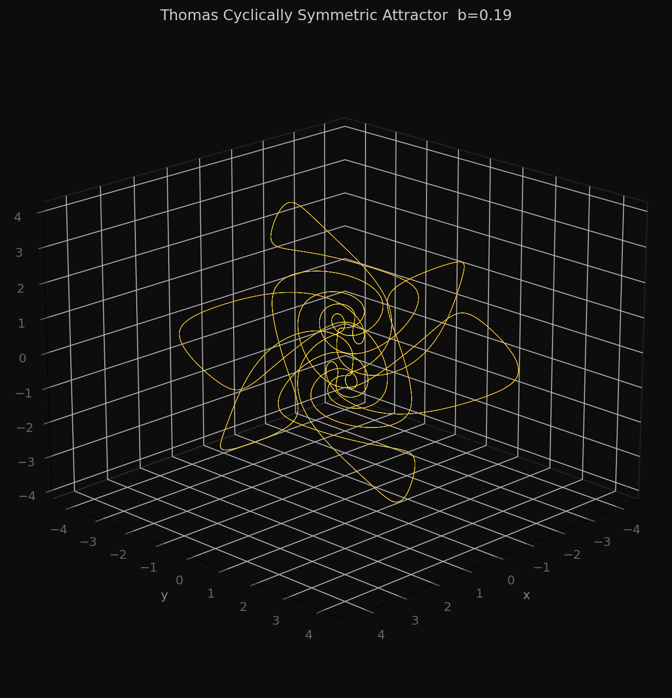
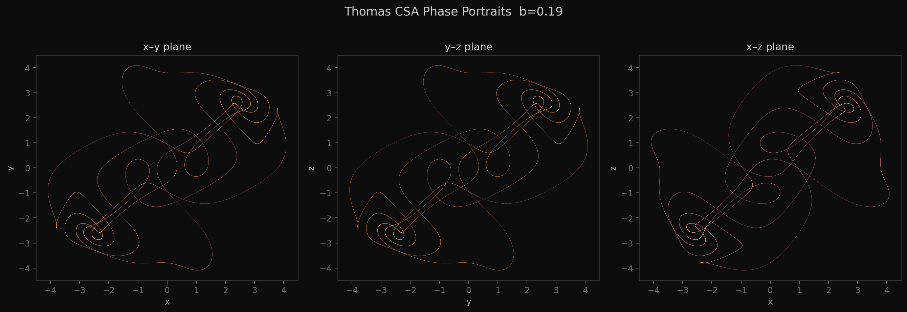

# ThomasCSA — Thomas Cyclically Symmetric Attractor

A [SuperCollider](https://supercollider.github.io/) UGen plugin that implements the **Thomas cyclically symmetric attractor** as an audio-rate (or control-rate) signal source.  
The attractor is integrated in real-time using a 4th-order Runge–Kutta (RK4) solver, giving a chaotic but continuously differentiable trajectory through phase space — ideal for generating complex, evolving audio signals.

---

## The Attractor

The Thomas system is defined by three coupled ODEs:

```
x' = sin(y) − b·x
y' = sin(z) − b·y
z' = sin(x) − b·z
```

The single parameter **b** controls the degree of dissipation.  For small b the system is chaotic; as b increases it undergoes a bifurcation sequence and eventually settles into a limit cycle.

| b value | behaviour |
|---------|-----------|
| < 0.20  | chaotic attractor |
| ~ 0.20  | near bifurcation point |
| > 0.32  | limit cycle / fixed point |



*3D trajectory coloured by time (plasma colourmap), integrated at b = 0.19.*



*Phase portraits projected onto the x–y, y–z, and x–z planes.*

---

## UGen Interface

```supercollider
ThomasCSA.ar(stepSize, b)
ThomasCSA.kr(stepSize, b)
```

Returns **three** output channels: `[x, y, z]`.

| Argument | Description | Typical range |
|----------|-------------|---------------|
| `stepSize` | Integration step size — sets the "speed" of the attractor. Larger values move faster through phase space and push higher frequencies. | 0.0001 – 1.0 |
| `b` | Bifurcation / dissipation parameter. Stay below ~0.32 for chaos. | 0.01 – 0.28 |

---

## Usage Examples

```supercollider
// Raw audio oscillator — mouse controls step size and b
{ ThomasCSA.ar(MouseX.kr(0.001, 1), MouseY.kr(0.01, 0.28)) * 0.2 }.play

// Chaotic FM: use x output as a slow modulator
{ SinOsc.ar(ThomasCSA.ar(0.01, MouseX.kr(0.001, 0.3))[0] * 300) * 0.4 }.play

// Stereo difference signal — all three axes used
SynthDef(\thomas, { |out=0, dt=0.1, b=0.18|
    var x = ThomasCSA.ar(MouseX.kr(0.0001, 1.0), MouseY.kr(0.01, 0.2));
    Out.ar(out, [x[0] - x[1], x[1] - x[2]] * 0.1);
}).add;

Synth(\thomas)
```

---

## Requirements

- **SuperCollider** ≥ 3.10
- **CMake** ≥ 3.5
- SuperCollider **source code** (for building)

---

## Building

Clone the repo and set up the build directory:

```bash
git clone https://github.com/MaxWorgan/thomas_cyclically_symmetric_attractor
cd thomas_cyclically_symmetric_attractor
mkdir build && cd build
```

Configure and build:

```bash
cmake .. -DCMAKE_BUILD_TYPE=Release
cmake --build . --config Release
cmake --build . --config Release --target install
```

**Install location** — by default the plugin is installed into the SuperCollider extensions directory discovered by CMake.  To override:

```bash
cmake .. -DCMAKE_BUILD_TYPE=Release -DCMAKE_INSTALL_PREFIX=/path/to/extensions
```

**SuperCollider source path** — the build system expects the SC source tree at `../supercollider`.  If yours is elsewhere:

```bash
cmake .. -DSC_PATH=/path/to/sc/source
```

---

## Development

After adding or removing source files, regenerate `CMakeLists.txt`:

```bash
./regenerate --help   # see available options
./regenerate          # update CMakeLists.txt
```

---

## License

See [LICENSE](LICENSE).

---

*Author: Max Worgan*
